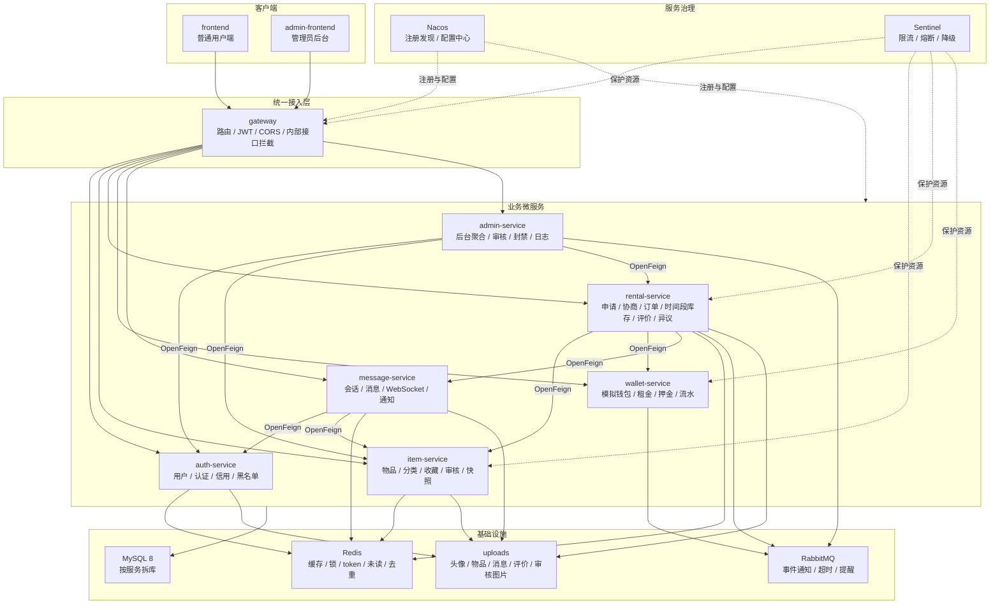

# 微服务架构与模块设计

## 1. 总体架构



## 2. 后端模块

```text
backend/
  pom.xml
  common/
  gateway/
  auth-service/
  item-service/
  rental-service/
  wallet-service/
  message-service/
  admin-service/
```

## 3. 服务端口建议

| 服务 | 端口 | 数据库 | 职责 |
|---|---:|---|---|
| gateway | 8080 | 无 | 统一入口、JWT、CORS、路由、内部接口拦截 |
| auth-service | 8081 | sr_auth | 注册登录、用户资料、信用分、封禁、黑名单 |
| item-service | 8082 | sr_item | 物品发布、编辑、上下架、分类、收藏、审核、快照 |
| rental-service | 8083 | sr_rental | 租借申请、协商、订单、时间段库存、评价、异议 |
| wallet-service | 8084 | sr_wallet | 模拟钱包、充值、租金支付、押金冻结释放、流水 |
| message-service | 8085 | sr_message | 会话、消息、WebSocket、系统通知、未读 |
| admin-service | 8086 | sr_admin | 管理员登录入口聚合、审核、封禁、操作日志、异议查看 |

## 4. Gateway 职责

- 所有前端请求统一经过 Gateway。
- 登录、注册、公开物品列表、公开物品详情、分类可匿名访问。
- 其他普通用户接口必须携带 JWT。
- 管理员接口必须携带管理员 JWT；数据库中 `role = 1`，JWT 和下游请求头中使用 `role = ADMIN`。
- Gateway 解析 JWT 后向下游注入：

```text
X-User-Id
X-User-Role
```

- 外部访问 `/internal/**` 直接返回 403。
- WebSocket 路径 `/ws/**` 转发到 message-service。

## 5. 跨服务调用

| 调用方 | 被调用方 | 用途 | 容错策略 |
|---|---|---|---|
| rental-service | item-service | 查询物品、校验物品状态、读取总数量、创建物品快照 | Sentinel 熔断，失败返回“物品服务繁忙” |
| rental-service | wallet-service | 订单租金支付、押金冻结、订单补缴、订单完成结算、订单取消退款、逾期费用结算 | Sentinel 熔断，失败返回“钱包服务繁忙” |
| rental-service | message-service | 发送申请、订单、系统通知卡片 | 失败记录日志，不阻断主状态变更 |
| item-service | wallet-service | 发布物品前校验用户钱包是否欠费 | 失败返回“钱包服务繁忙” |
| message-service | auth-service | 查询用户公开信息和封禁状态 | 降级为默认用户展示 |
| message-service | item-service | 查询消息关联物品标题和图片 | 降级为“物品信息暂不可用” |
| message-service | wallet-service | 发送消息前校验用户钱包是否欠费 | 失败返回“钱包服务繁忙” |
| admin-service | auth-service | 用户资料审核、封禁、状态查询 | 失败返回后台错误 |
| admin-service | item-service | 物品审核、强制下架 | 失败返回后台错误 |
| admin-service | rental-service | 异议查看、订单查询 | 失败返回后台错误 |

## 6. 事件设计

RabbitMQ 事件建议：

```text
rental.application.created
rental.proposal.updated
rental.order.created
rental.payment.timeout
wallet.payment.completed
wallet.deposit.frozen
rental.order.shipped
rental.order.received
rental.return.reminder
rental.order.completed
admin.audit.rejected
user.status.changed
message.notification.created
```

事件约定：

1. `rental-service` 拥有订单状态，`wallet-service` 只负责资金记录和结算结果。
2. 待付款订单超时优先用 RabbitMQ TTL + 死信队列触发 `rental.payment.timeout`，定时任务作为兜底补偿。
3. 关键事件消费必须幂等，至少覆盖订单超时、支付完成、押金冻结、订单完成、审核整改通知。

P0 必须演示：

- 待付款订单超时取消。
- 物品审核要求整改后产生通知。
- 支付完成后订单状态推进并产生消息卡片。

## 7. 包结构标准

每个业务服务优先使用：

```text
com.share.rental.<service>
  config/
  controller/
  service/
  service/impl/
  mapper/
  entity/
  dto/
  vo/
  enums/
  feign/
  task/
  mq/
  exception/
```

`common` 放：

```text
ApiResponse
ErrorCode
BusinessException
GlobalExceptionHandler
JwtUtil
RedisKey
FeignConfig
InternalTokenInterceptor
PageResult
```
